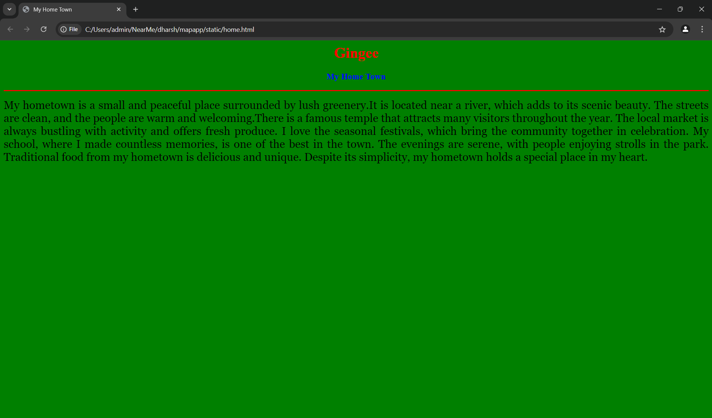
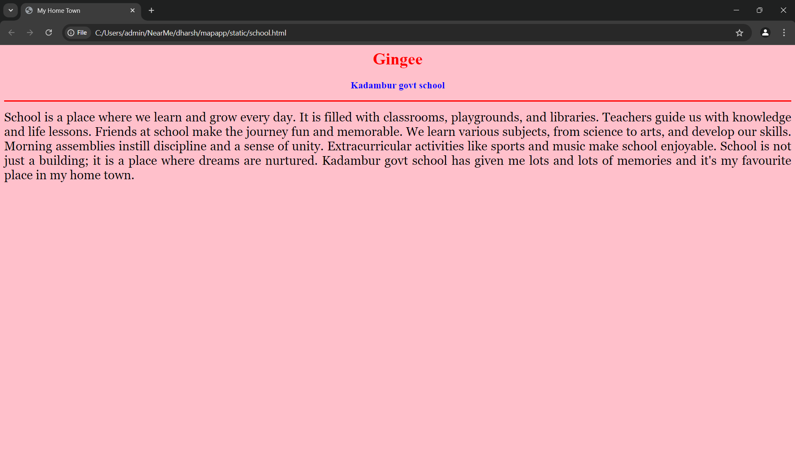
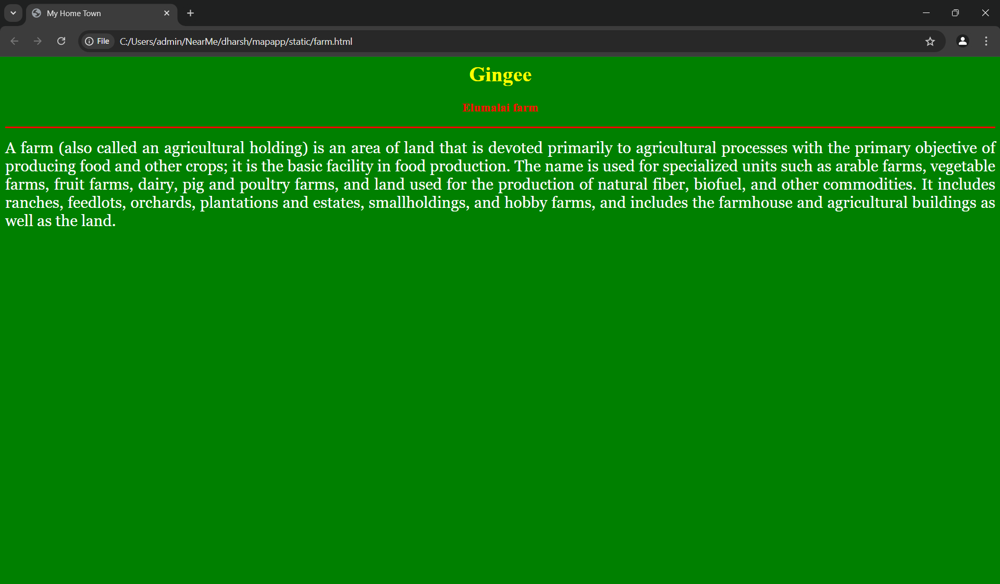
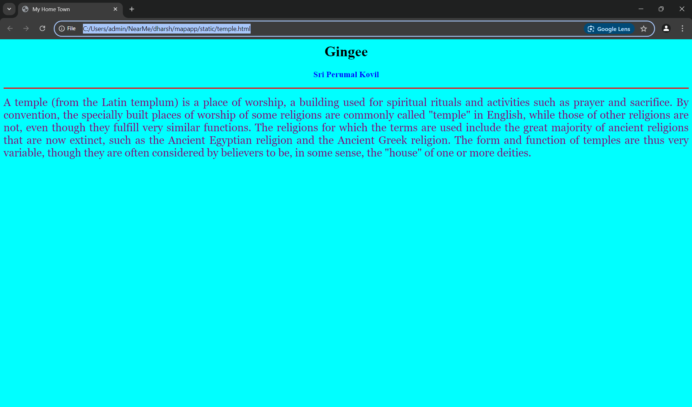
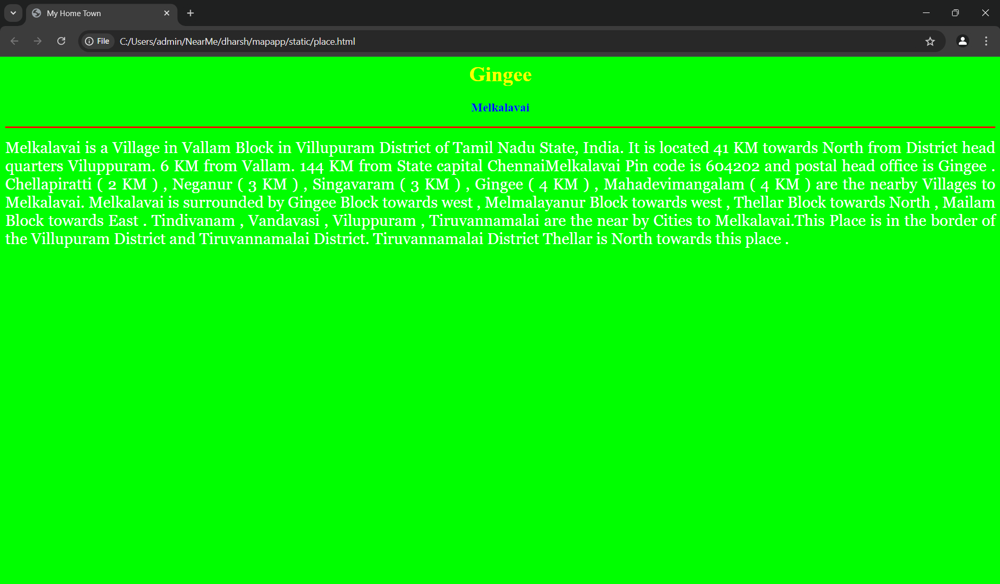
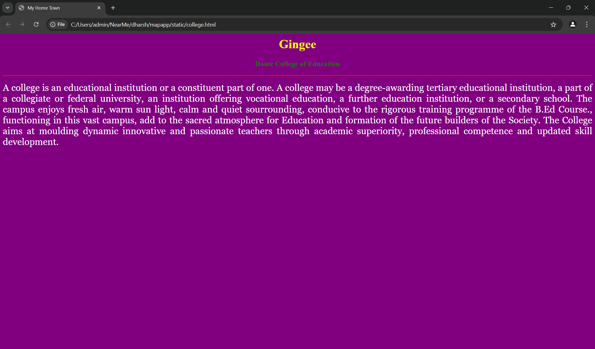

# Ex04 Places Around Me
## Date: 26.11.2024

## AIM
To develop a website to display details about the places around my house.

## DESIGN STEPS

### STEP 1
Create a Django admin interface.

### STEP 2
Download your city map from Google.

### STEP 3
Using ```<map>``` tag name the map.

### STEP 4
Create clickable regions in the image using ```<area>``` tag.

### STEP 5
Write HTML programs for all the regions identified.

### STEP 6
Execute the programs and publish them.

## CODE
```
map.html

<html> 
<head>
    <title>My City</title>
</head>
<body>
<h1 align="center">
<font color="red"><b>Gingee</b></font>
</h1> 
<h3 align="center">
<font color="blue"><b>DHARSHINI S N (24900524)</b></font>
</h3>
<center>

<map name="MyCity">
    <area shape="rect" coords="700,250,850,400" href="home.html" title="My Home Town">
    <area target="_top" alt="Kadambur govt school" title="Kadambur govt school" href="school.html" coords="1195,378,145" shape="circle">
    <area target="_top" alt="Elumalai farm" title="Elumalai farm" href="farm.html" coords="980,549,118" shape="circle">
    <area target="_top" alt="Sri Perumal Kovil" title="Sri Perumal Kovil" href="temple.html" coords="1532,285,200" shape="circle">
    <area target="_top" alt="Melkalavai" title="Melkalavai" href="place.html" coords="192,192,548,663" shape="rect">
    <area target="_top" alt="Danie College of Education" title="Danie College of Education" href="college.html" coords="154,209,91" shape="circle">
</map>
</center>
</body> 
</html>

home.html


<html>
<head>
<title>My Home Town</title>
</head>
<body bgcolor="green"></body>
<h1 align="center">
<font color="red"><b>Gingee</b></font>
</h1>
<h3 align="center">
<font color="blue">My Home Town</b></font>
</h3>
<hr size="3" color="red">
<p align="justify">
<font face="Georgia" size="5" color="black">
    My hometown is a small and peaceful place surrounded by lush greenery.It is located near a river, which adds to its scenic beauty.
    The streets are clean, and the people are warm and welcoming.There is a famous temple that attracts many visitors throughout the year.
    The local market is always bustling with activity and offers fresh produce. I love the seasonal festivals, which bring the community together in celebration.
    My school, where I made countless memories, is one of the best in the town. The evenings are serene, with people enjoying strolls in the park.
    Traditional food from my hometown is delicious and unique. Despite its simplicity, my hometown holds a special place in my heart.
</font>
</p>
</body>
</html>

school.html

<html>
<head>
<title>My Home Town</title>
</head>
<body bgcolor="pink"></body>
<h1 align="center">
<font color="red"><b>Gingee</b></font>
</h1>
<h3 align="center">
<font color="blue">Kadambur govt school</b></font>
</h3>
<hr size="3" color="red">
<p align="justify">
<font face="Georgia" size="5" color="black">
    School is a place where we learn and grow every day. It is filled with classrooms, playgrounds, and libraries.
    Teachers guide us with knowledge and life lessons. Friends at school make the journey fun and memorable.
    We learn various subjects, from science to arts, and develop our skills. Morning assemblies instill discipline and a sense of unity.
    Extracurricular activities like sports and music make school enjoyable. School is not just a building; it is a place where dreams are nurtured.
    Kadambur govt school has given me lots and lots of memories and it's my favourite place in my home town.
</font>
</p>
</body>
</html>

farm.html

<html>
<head>
<title>My Home Town</title>
</head>
<body bgcolor="green"></body>
<h1 align="center">
<font color="yellow"><b>Gingee</b></font>
</h1>
<h3 align="center">
<font color="red">Elumalai farm</b></font>
</h3>
<hr size="3" color="red">
<p align="justify">
<font face="Georgia" size="5" color="white">
    A farm (also called an agricultural holding) is an area of land that is devoted primarily to agricultural processes with the primary objective of producing food and other crops; it is the basic facility in food production.
     The name is used for specialized units such as arable farms, vegetable farms, fruit farms, dairy, pig and poultry farms, and land used for the production of natural fiber, biofuel, and other commodities. 
     It includes ranches, feedlots, orchards, plantations and estates, smallholdings, and hobby farms, and includes the farmhouse and agricultural buildings as well as the land.
</font>
</p>
</body>
</html>

temple.html

<html>
<head>
<title>My Home Town</title>
</head>
<body bgcolor="cyan"></body>
<h1 align="center">
<font color="black"><b>Gingee</b></font>
</h1>
<h3 align="center">
<font color="blue">Sri Perumal Kovil</b></font>
</h3>
<hr size="3" color="red">
<p align="justify">
<font face="Georgia" size="5" color="purple">
    A temple (from the Latin templum) is a place of worship, a building used for spiritual rituals and activities such as prayer and sacrifice. 
    By convention, the specially built places of worship of some religions are commonly called "temple" in English, while those of other religions are not, even though they fulfill very similar functions.
    The religions for which the terms are used include the great majority of ancient religions that are now extinct, such as the Ancient Egyptian religion and the Ancient Greek religion.
    The form and function of temples are thus very variable, though they are often considered by believers to be, in some sense, the "house" of one or more deities.
</font>
</p>
</body>
</html>

place.html

<html>
<head>
<title>My Home Town</title>
</head>
<body bgcolor="lime"></body>
<h1 align="center">
<font color="yellow"><b>Gingee</b></font>
</h1>
<h3 align="center">
<font color="blue">Melkalavai</b></font>
</h3>
<hr size="3" color="red">
<p align="justify">
<font face="Georgia" size="5" color="white">
    Melkalavai is a Village in Vallam Block in Villupuram District of Tamil Nadu State, India. It is located 41 KM towards North from District head quarters Viluppuram. 6 KM from Vallam. 144 KM from State capital ChennaiMelkalavai Pin code is 604202 and postal head office is Gingee . Chellapiratti ( 2 KM ) , Neganur ( 3 KM ) , Singavaram ( 3 KM ) , Gingee ( 4 KM ) , Mahadevimangalam ( 4 KM ) are the nearby Villages to Melkalavai. Melkalavai is surrounded by Gingee Block towards west , Melmalayanur Block towards west , Thellar Block towards North , Mailam Block towards East .
    Tindivanam , Vandavasi , Viluppuram , Tiruvannamalai are the near by Cities to Melkalavai.This Place is in the border of the Villupuram District and Tiruvannamalai District. Tiruvannamalai District Thellar is North towards this place .
</font>
</p>
</body>
</html>

college.html

<html>
<head>
<title>My Home Town</title>
</head>
<body bgcolor="purple"></body>
<h1 align="center">
<font color="yellow"><b>Gingee</b></font>
</h1>
<h3 align="center">
<font color="green">Danie College of Education</b></font>
</h3>
<hr size="3" color="red">
<p align="justify">
<font face="Georgia" size="5" color="white">
    A college is an educational institution or a constituent part of one. A college may be a degree-awarding tertiary educational institution, a part of a collegiate or federal university, an institution offering vocational education, a further education institution, or a secondary school.
    The campus enjoys fresh air, warm sun light, calm and quiet sourrounding, conducive to the rigorous training programme of the B.Ed Course., functioning in this vast campus, add to the sacred atmosphere for Education and formation of the future builders of the Society. 
    The College aims at moulding dynamic innovative and passionate teachers through academic superiority, professional competence and updated skill development.
</font>
</p>
</body>
</html>

```


## OUTPUT








## RESULT
The program for implementing image maps using HTML is executed successfully.
